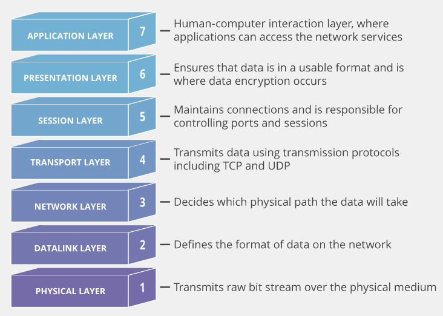

# OSI 7계층

### OSI 7계층이란

- OSI(Open System Interconnection) 7계층은 국제 표준화 기구인 ISO에서 개발한 컴퓨터 네트워크 프로토콜 디자인과 통신을 계층으로 나누어 설명한 개방형 시스템 상호 연결 모델
- 각 계층은 서로 독립적으로 구성되어 있고, 각 계층은 하위 계층의 기능을 이용하여 상위 계층에 기능을 제공
- Physical Layer부터 Application Layer까지 총 7계층으로 정의되어 있음
- 해당 계층과 관련된 제어 정보가 포함된 헤더가 계층을 지날 때마다 포함되거나 제거됨
- 1\~3계층은 하드웨어, 4\~7계층은 소프트웨어 영역
    - 1\~3계층은 하드웨어가 실질적으로 수행
    - 4\~6계층은 OS가 7계층은 프로그램이 역할을 수행

### 계층을 나누는 이유

- 복잡한 시스템을 layering 함으로써 시스템을 구성하는 각 모듈이 제공하는 서비스를 쉽게 파악할 수 있음
    - 모듈 사이에 주고 받는 서비스를 확인함으로써 모듈 사이의 관계를 쉽게 이해할 수 있음
- 복잡한 시스템을 유지보수하기 쉬움
    - 각 layer가 수정되어도 다른 layer에 영향을 미치지 않음
    - 모듈간 교체 및 확장 등이 자유로움

### 참조하는 이유

- OSI 7계층은 위에서 설명했듯이 ISO에서 개발한 표준 모델이다.
- 표준 모델을 참조함으로써 각 통신 업체의 제품들은 통신할 수 있으며 호환이 가능하다.

 

### Application Layer

- 응용 프로세스와 직접 맞닿아 응용 서비스를 수행하는 계층
- HTTP, FTP, SMTP, POP3와 같은 프로토콜이 존재
- Transport Layer에서 제공한 소켓 API를 이용하여 데이터를 송, 수신

### Presentation Layer

- 데이터 표현방식, 상이한 부호체계 간의 변화에 대해 규정
- 데이터 인코딩, 압축, 암호화 등의 역할을 수행
    - 송, 수신자가 이해할 수 있도록 데이터를 표현
    - Application Layer의 부담을 줄여줌

### Session Layer

- 통신 장치 간의 상호작용 및 동기화를 제공
- 연결 세션에서 데이터 교환과 에러 발생 시 복구 관리
- OS가 통신을 하기 위한 세션을 확립, 유지, 중단 처리

**세션이란 ?** 

일정 시간 동안 같은 사용자로부터 들어오는 일련의 요구를 하나의 상태로 보고 그 상태를 일정하게 유지하는 기술

### Transport Layer

- 종단 간 신뢰성 있고 정확한 데이터 전송을 담당
- 송신자와 수신자 간의 신뢰성 있고 효율적인 데이터를 전송하기 위하여 오류 검출 및 복구, 흐름제어와 중복 검사 등을 수행
- 데이터 전송을 위해 port번호 사용
- 대표적인 프로토콜로 TCP, UDP가 존재
    - TCP의 전송 단위는 segment, UDP의 전송 단위는 datagram

### Network Layer

- 데이터 단위로 패킷 사용
- 라우팅을 통해 안전하고 빠르게 패킷 전달
    - end to end 통신
    - 다양한 라우팅 기법이 존재
- 외에도 세그멘테이션, 오류 제어, 인터네트워킹 등을 수행
- IP 주소를 통해 통신

### Data Link Layer

- 직접 연결된 서로 다른 2개의 네트워킹 장치 간의 데이터 전송을 담당
    - 흐름 제어, 오류 제어, 접근 제어 등을 통해 안전한 정보 전달을 도움
- 전송되는 데이터를 프레임이라고 함
- 프로토콜은 프레임의 종류, 길이 등의 정보를 정의
    - 용도에 따라 다름
- MAC 주소를 통해 통신

### Physical Layer

- 데이터가 전송되는 물리적인 매체
    - 통신 케이블, 리피터 허브, 모뎀 등
- 모든 하드웨어의 물리적 및 전기적 특성을 정의
    - 이러한 특성은 신호를 만드는데 이용
- 아날로그 신호를 디지털 신호로 변경
- 통신 단위로 0과 1로 이루어진 비트를 사용
- 데이터를 전달만 할 뿐 어떤 데이터인지, 어떤 에러가 있는지 등은 신경쓰지 않음
