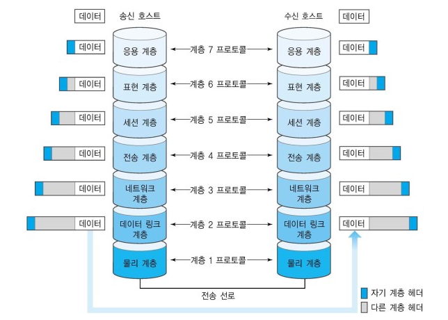

# OSI 7 계층

- 국제표준화기구(ISO)에서 개발한 모델로, 컴퓨터 네트워크 프로토콜 디자인과 통신을 계층으로 나누어 설명한 것이다.
- 이 모델은 프로토콜을 기능별로 나눈 것이다.
- 각 계층은 하위 계층의 기능만을 이용하고, 상위 계층에게 기능을 제공한다.
- '프로토콜 스택' 혹은 '스택'은 이러한 계층들로 구성되는 프로토콜 시스템이 구현된 시스템을 가리키는데, 프로토콜 스택은 하드웨어나 소프트웨어 혹은 둘의 혼합으로 구현될 수 있다.
- 일반적으로 하위 계층들은 하드웨어로, 상위 계층들은 소프트웨어로 구현된다.

## 7계층은 왜 나눌까?

통신이 일어나는 과정을 단계별로 알 수 있고, 특정한 곳에 이상이 생기면 그 단계만 수정할 수 있기 때문이다.

## 7) 응용 계층(Application layer)

> HTTP, FTP, DNS 등

- 응용 프로세스와 직접 관계하여 일반적인 응용 서비스를 수행
- 사용자를 위한 인터페이스를 지원. 사용자에게 보이는 유일한 계층
- 사용자 인터페이스, 전자우편, 데이터베이스 관리 등의 서비스를 제공

## 6) 표현 계층 (Presentation layer)

> JPEG, MPEG, GIF, TIFF

- 데이터의 인코딩 및 디코딩이 이루어지는 계층
- 파일 인코딩, 명령어를 포장, 압축, 암호화

## 5) 세션(Session)

> API, Socket

- 데이터가 통신하기 위한 논리적 연결을 담당
  - 네트워크상 양쪽 연결을 관리하고 연결을 지속
- TCP/IP 세션을 만들고 없애는 책임을 지니고 있다.

## 4) 전송 계층 (Transport layer)

> TCP, UDP

- TCP와 UDP 프로토콜을 통해 통신을 활성화
- 포트를 열어두고, 프로그램들이 전송을 할 수 있도록 제공
- 데이터를 이 계층에서 합산하여 보내줌
- 헤더에 송/수신지 포트번호를 포함

## 3) 네트워크(Network)

> 라우터, IP

- 데이터를 목적지까지 가장 안전하고 빠르게 전달하는 기능을 담당한다.
- 라우터를 통해 이동할 경로를 선택하여 IP 주소를 지정하고, 해당 경로에 따라 패킷을 전달해준다.
- 라우팅, 흐름 제어, 오류 제어, 세그먼테이션 등을 수행한다.

## 2) 데이터 링크(Data Link)

> 브릿지, 스위치 등

- 물리 계층으로 송수신되는 정보를 관리하여 안전하게 전달되도록 도와주는 역할
  - 데이터를 전송시 데이터 전송 오류를 감지하는 기능을 제공하며 오류가 감지되면 재전송
- Mac 주소를 통해 통신. 프레임에 Mac 주소를 부여하고 에러검출, 재전송, 흐름제어를 진행한다.

## 1) 물리(Physical)

> 리피터, 케이블, 허브 등

- 데이터를 전기적인 신호로 변환해서 주고받는 기능을 진행
  - 기본 네트워크 하드웨어 전송 기술을 이룸
- 데이터를 전송하는 역할만 진행 -> 데이터 종류, 에러 등의 확인 안함
- 전송 단위는 Bit(0/1)이다.

## Reference

- <https://github.com/gyoogle/tech-interview-for-developer/blob/master/Computer%20Science/Network/OSI%207%20%EA%B3%84%EC%B8%B5.md>
- <https://github.com/WeareSoft/tech-interview/blob/master/contents/network.md#osi-7%EA%B3%84%EC%B8%B5>
- <https://ko.wikipedia.org/wiki/OSI_%EB%AA%A8%ED%98%95>
- <https://blog.naver.com/PostView.nhn?blogId=pst8627&logNo=221670903384>