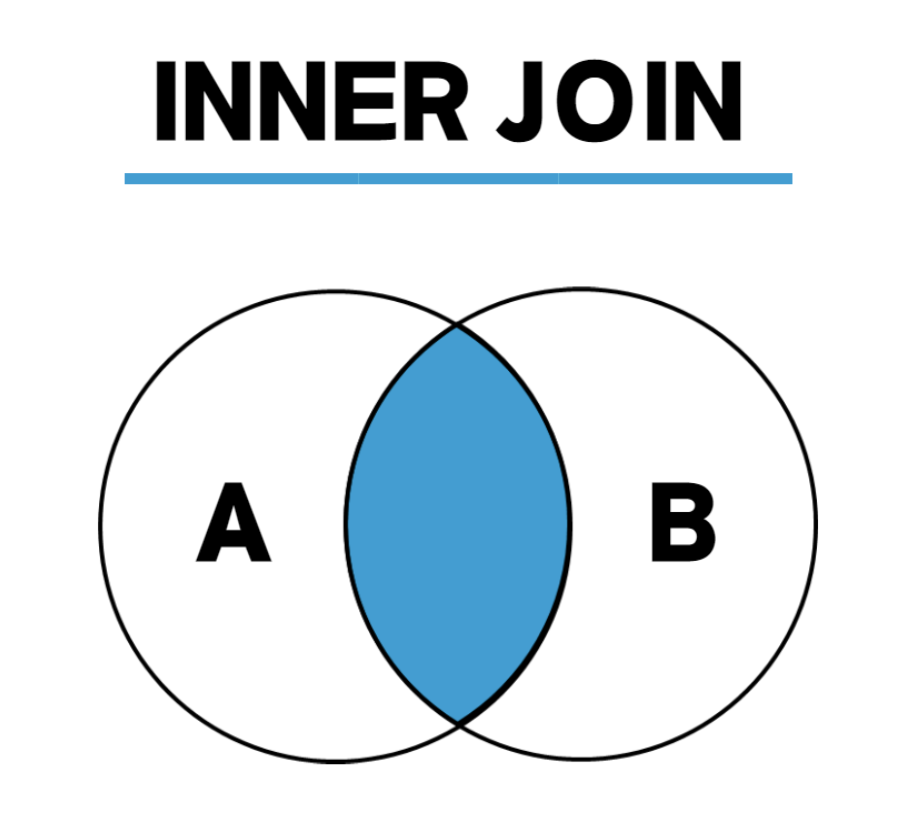
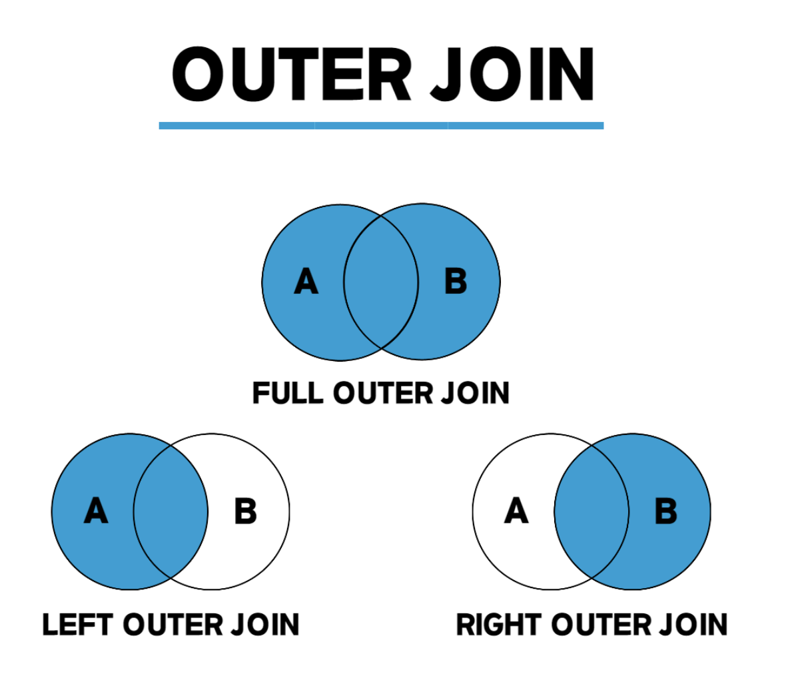
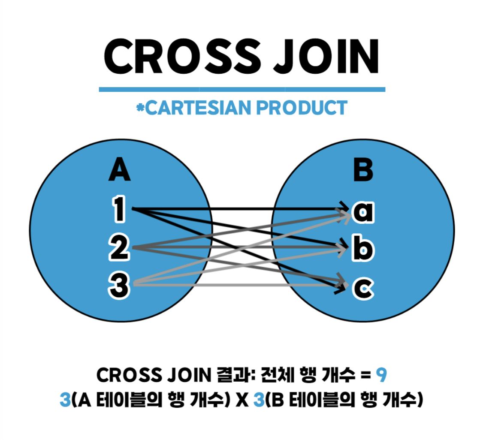
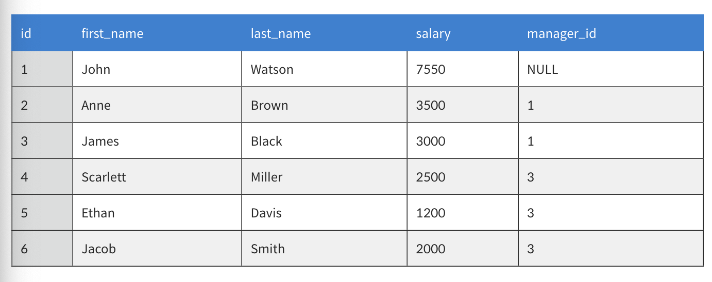
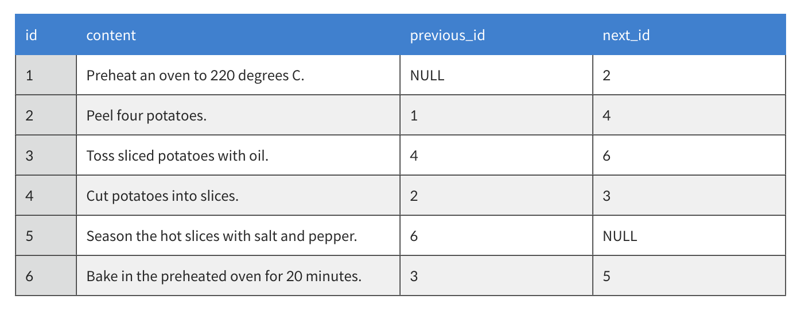
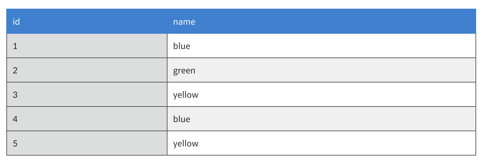

## JOIN

- 둘 이상의 테이블을 연결
- INNER JOIN, OUTER(LFET,RIGHT,FULL) JOIN, CROSS JOIN이 있음

### INNER JOIN



```sql
SELECT <열>
FROM <1번 테이블>
	INNER JOIN <2번 테이블>
	ON <조인 조건>
WHERE <검색조건>
```

두 테이블에서 모두 존재하는 값만 출력, 그림과 같이 교집합

### OUTER JOIN



```sql
SELECT <열>
FROM <1번 테이블(LEFT)>
	<LEFT | RIGHT | FULL>OUTER JOIN <2번 테이블(RIGHT)>
	ON <조인 조건>
WHERE <검색조건>
```

- LEFT : 왼쪽 테이블의 모든 값
  - JOIN을 진행하면서 왼쪽에 있는 테이블이 기준이 된다
  - 왼쪽 테이블에는 값이 있지만 JOIN을 진행하는 오른쪽 테이블에 값이 없을 경우네는 NULL로 표시된다
- RIGHT : 오른쪽 테이블의 모든 값
  - LEFT의 방식과 동일
- FULL : 왼쪽 또는 오른쪽 테이블의 모든 값
  - FULL 같은 경우네는 지원하지 않는 DB가 많다 → UNION 함수를 이용해서 대체 가능하다
  - 왼쪽 외부조인과 오른쪽 외부조인의 합이며 값이 없을 경우 역시 NULL로 표시된다

### CROSS JOIN



```sql
SELECT *
FROM <1번 테이블>
	CROSS JOIN <2번 테이블>
```

말 그대로 테이블간에 연결될 수 있는 모든 경우의 수를 산출

### SELF JOIN


```sql
SELECT <열>
FROM <1번 테이블> 별칭
 INNER JOIN <1번 테이블> 별칭
 ON <조인될 조건>
WHERE <검색조건>
```

동일한 테이블을 대상으로 조인, 별명이 반드시 있어야 한다

- 왜?
  - 동일 테이블이기 때문에 테이블, 컬럼이름이 동일 → 식별을 해주기 위해서 별칭을 지정한다
- 셀프조인을 왜 사용할까?
  - 위계성 데이터를 다룰 때
    
    위와 같은 테이블에서 한 테이블로 자신과 manager의 정보를 한번에 보고 싶을때 사용할 수 있다
    manager_id 와 id 조회
  - 순차성 데이터
    
    next_id를 통해서 1→6까지 순차적으로 보여지는 테이블을 보고 싶을 때
    next_id 와 id 조회
  - 중복값 찾기
    
    name을 조회해서 중복값을 가지는 값 출력
