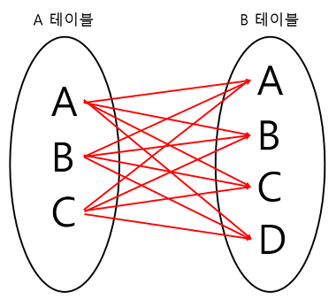

# Database - Join

> 2 개 이상의 테이블이나 데이터베이스를 연결하여 데이터를 검색하는 방법

테이블을 연결하려면, 적어도 하나의 칼럼을 서로 공유하고 있어야 하므로 이를 이용하여 데이터 검색에 활용한다.


## INNER JOIN


- 교집합으로, 기준 테이블과 join 테이블의 중복된 값을 보여준다.
- 가장 흔한 JOIN으로 기본 형식으로 간주

```sql
-- 명시적 조인
SELECT *
FROM employee INNER JOIN department
ON employee.DepartmentID = department.DepartmentID;
```

```sql
-- 암시적 조인
SELECT *
FROM employee, department
WHERE employee.DepartmentID = department.DepartmentID;
```


### 동등 조인 (EQUI JOIN)

- 비교자 기반의 조인이며, 조인 구문에서 **동등비교만을 사용**한다.
- 다른 비교 연산자(<와 같은)를 사용하는 것은 동등 조인으로서의 조인의 자격을 박탈하는 것이다.

### 자연 조인 (NATURAL JOIN)

- 동등 조인의 한 유형으로 조인 구문이 조인된 테이블에서 동일한 컬럼명을 가진 2개의 테이블에서 모든 컬럼들을 비교함으로써, 암시적으로 일어나는 구문이다.
- 결과적으로 나온 조인된 테이블은 동일한 이름을 가진 컬럼의 각 쌍에 대한 단 하나의 컬럼만 포함하고 있다.

```sql
SELECT * FROM employee NATURAL JOIN department;
```


## LEFT OUTER JOIN


- 왼쪽테이블 기준으로 JOIN
- 왼쪽 테이블의 모든 데이터를 포함하는 결과 반환

```sql
SELECT *
FROM employee LEFT OUTER JOIN department
ON employee.DepartmentID = department.DepartmentID;
```


## RIGHT OUTER JOIN


- 오른쪽 테이블 기준으로 JOIN
- 오른쪽 테이블의 모든 데이터를 포함하는 결과 집합을 생성

```sql
SELECT *
FROM employee RIGHT OUTER JOIN department
ON employee.DepartmentID = department.DepartmentID;
```


## FULL OUTER JOIN


- 합집합을 말한다. A와 B 테이블의 모든 데이터가 검색된다.

```sql
SELECT *
FROM employee FULL OUTER JOIN department
ON employee.DepartmentID = department.DepartmentID;
```


## CROSS JOIN



- 조인되는 두 테이블의 곱집합
- m행을 가진 테이블과 n행을 가진 테이블이 교차 조인되면 m*n 개의 행을 생성한다

```sql
-- 명시적 조인
SELECT * FROM employee CROSS JOIN department;
```

```sql
-- 묵시적 조인
SELECT * FROM employee, department;
```


## SELF JOIN


자기자신과 자기자신을 조인하는 것이다.

```sql
SELECT
A.NAME, B.AGE
FROM EX_TABLE A, EX_TABLE B
```

## Reference

- [https://github.com/gyoogle/tech-interview-for-developer/blob/master/Computer Science/Database/[Database SQL] JOIN.md](https://github.com/gyoogle/tech-interview-for-developer/blob/master/Computer%20Science/Database/%5BDatabase%20SQL%5D%20JOIN.md)
- [https://github.com/WeareSoft/tech-interview/blob/master/contents/db.md#join](https://github.com/WeareSoft/tech-interview/blob/master/contents/db.md#join)
