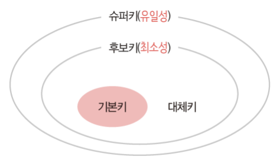

# Database Key

> 검색, 정렬 시 Tuple을 구분할 수 있는 기준이 되는 Attribute

## Super Key (슈퍼키)

> 유일성의 특성을 만족하는 속성 또는 속성들의 집합 → 최소성은 만족 X
> 
- 유일성: Key로 하나의 Tuple을 유일하게 식별할 수 있음

## Candidate Key (후보키)

> 유일성과 최소성을 만족하는 속성들의 부분 집합 → 기본키로 사용할 수 있음
> 
- 최소성: 꼭 필요한 속성으로만 구성

## Primary Key (기본키)

> 후보키 중 선택한 Main Key
> 
- 하나의 테이블에 단 하나의 기본키만 정의 가능
- 동일한 값이 중복될 수 없음 → 유일 인덱스를 자동으로 생성
- Null 값을 가질 수 없음
- UNIQUE + NOT NULL 만족

## Alternate Key (대체키)

> 후보키 중 기본키를 제외한 나머지 키 (보조키)
> 

## Foreign Key (외래키)

> 다른 릴레이션의 기본키를 그대로 참조하는 속성의 집합
> 
- 데이터의 무결성을 위해 존재
  - 무결성: 데이터가 항상 정확한 값을 유지하는 성질
  - 예를 들어 고객 릴레이션의 고객 아이디가 변경되었는데 주문 릴레이션의 주문 고객의 값은 변경되지 않았다면 두 값은 서로 같은 값이 어야 하는데 다른 값이 되어 버림 → 무결성 깨짐