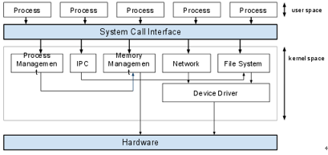
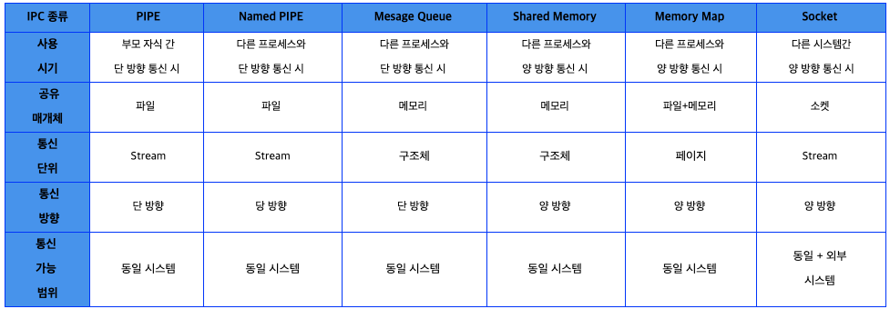

## IPC(Inter Process Communication)

- IPC는 왜 필요할까?

  

  - Process는 완전히 독립된 실행객체 → 다른 프로세스의 영향을 받지 않지만 별도의 설비 없이는 서로간에 통신이 어려움
  - 그래서 커널 영역에서 내부 프로세스간 통신을 제공하게 됨

- 다양한 IPC 설비
  
  - PIPE
    - FIFO 구조
    - WRITE,READ 만 가능
    - 쌍방 통신을 위해서는 Write용 Read용 각각 하나씩 만들어야 함 → 구현이 복잡
      - 프로세스가 read 대기중이라면 끝나기 전까지 write가 불가능 하기 때문에
  - Named PIPE
    - 부모 프로세스와는 무관
    - FIFO 구조
    - 서로 다른 프로세스들이 PIPE의 이름만 알면 통신 가능
    - 쌍방 통신을 위해서는 Write용 Read용 각각 하나씩 만들어야 함 → 구현이 복잡
      - 프로세스가 read 대기중이라면 끝나기 전까지 write가 불가능 하기 때문에
  - Message Queue
    - FIFO 구조
    - Memory를 사용한 PIPE
      - 메모리 공간(구조체)를 사용해서 여러개의 프로세스가 동시에 데이터를 쉽게 다룰 수 있음
  - Shared Memory( 마치 Thread의 메모리 영역 공유와 비슷)
    - 공유 메모리를 통해 통신
    - 일정한 크기의 메모리를 프로세스간에 공유하는 구조이며 공유 메모리는 커널에서 관리
    - 양방향 통신이 가능하기 때문에 write,read 모두 필요로 할때 사용
    - IPC들 중에서 가장 빠르게 작동이 가능(중개자 없이 곧바로 메모리에 접근이 가능하기 때문)
  - Memory Map
    - 파일을 프로세스의 메모리에 일정 부분 맵핑
    - 대용량 데이터 공유 + IO 작업이 느릴때
  - Socket
    - 네트워크 소켓 통신에 사용
    - Client-Server 구조로 데이터 통신
    - 네트워크 프로그래밍, 데이터 세그먼트 처리 필요
  - Semaphore
    - 프로세스 간 데이터를 동기화 하고 보호하는데 목적이 있음
    - Shared Memory를 통해 데이터를 공유 할 때 프로세스 동시 접근을 막기 위해서 사용된다
