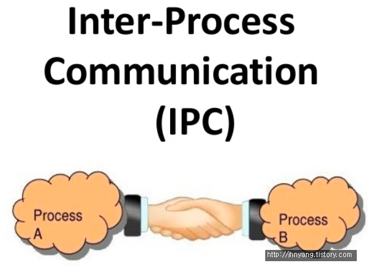
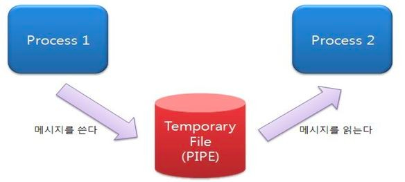
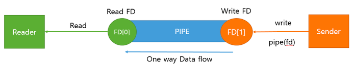
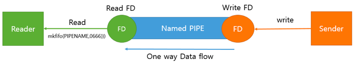
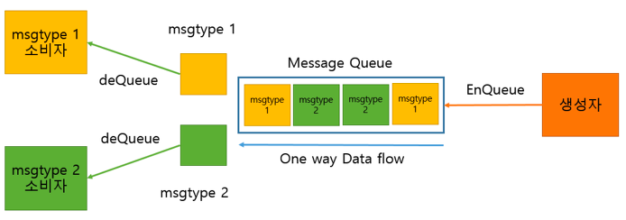
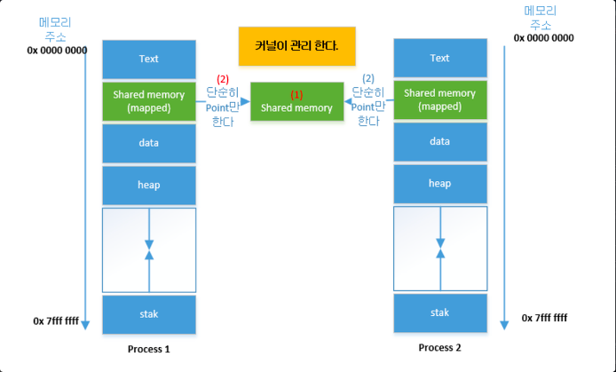
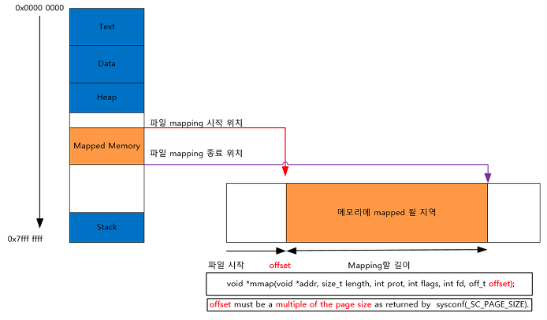
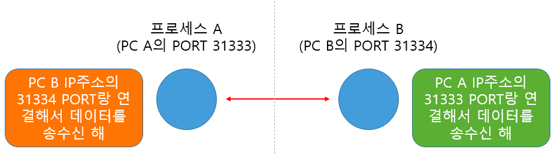

# IPC (Inter-Process Communication)

프로세스는 독립적으로 실행된다. 즉, 독립 되어있다는 것은 다른 프로세스에게 영향을 받지 않는다고 말할 수 있다. (스레드는 프로세스 안에서 자원을 공유하므로 영향을 받는다)

이런 독립적 구조를 가진 **프로세스 간의 통신**을 해야 하는 상황이 있을 것이다. 이를 가능하도록 해주는 것이 바로 IPC 통신이다.

프로세스는 커널이 제공하는 IPC 설비를 이용해 프로세스간 통신을 할 수 있게 된다.

## 프로세스 사이 통신이 스레드 사이 통신보다 어려운 이유

각 프로세스는 별도의 메모리 공간을 할당받고 독립적으로 존재하게 되는 반면 프로세스 안의 스레드는 공유하고 있는 메모리 공간이 있기 때문에 이를 활용하여 통신하면 된다.

프로세스는 통신할 수 있는 공간이 없기 때문에 통신을 위해 별도의 공간이 필요하기 때문에 스레드 사이 통신보다 더 어렵다.

## IPC 종류

### PIPE (파이프)

#### 익명 PIPE

- 파이프는 두 개의 프로세스를 연결하는데 하나의 프로세스는 데이터를 쓰기만 하고, 다른 하나는 데이터를 읽기만 할 수 있다.
- **한쪽 방향으로만 통신이 가능한 반이중 통신**이라고도 부른다.
- 따라서 양쪽으로 모두 송/수신을 하고 싶으면 2개의 파이프를 만들어야 한다.
- 매우 간단하게 사용할 수 있는 장점이 있고, 단순한 데이터 흐름을 가질 땐 파이프를 사용하는 것이 효율적이다. 단점으로는 전이중 통신을 위해 2개를 만들어야 할 때는 구현이 복잡해지고 낭비가 발생할 수 있다.
- 통신할 프로세스를 명확히 알 수 있는 경우에 사용한다. (부모-자식 프로세스 간 통신처럼) 외부 프로세스에서 사용할 수 없다.

#### Named PIPE(FIFO)

- Named 파이프는 전혀 모르는 상태의 프로세스들 사이 통신에 사용한다.
- 즉, 익명 파이프의 확장된 상태로 **부모 프로세스와 무관한 다른 프로세스도 통신이 가능한 것** (통신을 위해 이름있는 파일을 사용)
- FIFO 구조
- 하지만, Named 파이프 역시 읽기/쓰기 동시에 불가능함. 따라서 전이중 통신을 위해서는 익명 파이프처럼 2개를 만들어야 가능

### Message Queue (메시지 큐)

- 입출력 방식은 Named 파이프와 동일함
- 다른점은 메시지 큐는 파이프처럼 데이터의 흐름이 아니라 메모리 공간이다.
- PIPE, FIFO와는 달리, 사용할 데이터에 번호를 붙이면서 여러 프로세스가 동시에 데이터를 쉽게 다룰 수 있다.

### Shared Memory (공유 메모리)

- 파이프, 메시지 큐가 통신을 이용한 설비라면, **공유 메모리는 데이터 자체를 공유하도록 지원하는 설비**다.
- 프로세스의 메모리 영역은 독립적으로 가지며 다른 프로세스가 접근하지 못하도록 반드시 보호되야한다. 하지만 다른 프로세스가 데이터를 사용하도록 해야하는 상황도 필요할 것이다. 파이프를 이용해 통신을 통해 데이터 전달도 가능하지만, 스레드처럼 메모리를 공유하도록 해준다면 더욱 편할 것이다.
- 공유 메모리는 **프로세스간 메모리 영역을 공유해서 사용할 수 있도록 허용**해준다.
- 프로세스가 공유 메모리 할당을 커널에 요청하면, 커널은 해당 프로세스에 메모리 공간을 할당해주고 이후 모든 프로세스는 해당 메모리 영역에 접근할 수 있게 된다.
  - **중개자 없이 곧바로 메모리에 접근할 수 있어서 IPC 중에 가장 빠르게 작동함**
- 프로세스 사이 Read, Write 모두 가능하다.

### Memory Map (메모리 맵)

- 공유 메모리처럼 메모리를 공유해준다. 메모리 맵은 **열린 파일을 메모리에 맵핑시켜서 공유**하는 방식이다. (즉 공유 매개체가 파일+메모리)
- 파일은 시스템의 전역적인(모두 공유할 수 있는) 자원이므로 서로 다른 프로세스들끼리 데이터를 공유하는데 문제가 없을 것임을 예상할 수 있습니다.
- 주로 파일로 대용량 데이터를 공유해야 할 때, FILE IO가 느릴때 사용.

### Socket (소켓)

- 네트워크 소켓 통신을 통해 데이터를 공유한다.
- 클라이언트와 서버가 소켓을 통해서 통신하는 구조로, 원격에서 프로세스 간 데이터를 공유할 때 사용한다.
- 전이중 통신 가능
- 서버/클라이언트 환경을 구축하는데 용이 → 서버(bind, listen, accept), 클라이언트(connect)

## 정리

|IPC 종류|PIPE|Name PIPE|Message Queue|Shared Memory|Memory Map|Socket|
|---|---|---|---|---|---|---|
|사용시기|**부모 자식 간** **단방향** 통신 시|**다른 프로세스**와 **단방향** 통신 시|**다른 프로세스**와 **단방향** 통신 시|**다른 프로세스**와 **양방향** 통신 시|**다른 프로세스**와 **양방향** 통신 시|**다른 프로세스**와 **양방향** 통신 시|**다른 시스템**간 **양방향** 통신 시|
|공유 매개체|파일|파일|메모리|메모리|파일+메모리|소켓|
|통신 단위|Stream|Stream|구조체|구조체|페이지|Stream|
|통신 방향|단방향|단방향|단방향|단방향|양방향|양방향|양방향|
|통신 가능 범위|동일 시스템|동일 시스템|동일 시스템|동일 시스템|동일 시스템|동일 + 외부 시스템|

> 이러한 IPC 통신에서 프로세스 간 데이터를 동기화하고 보호하기 위해 세마포어와 뮤텍스를 사용한다. (공유된 자원에 한번에 하나의 프로세스만 접근시킬 때)

## Reference

- [https://github.com/gyoogle/tech-interview-for-developer/blob/master/Computer Science/Operating System/IPC(Inter Process Communication).md](https://github.com/gyoogle/tech-interview-for-developer/blob/master/Computer%20Science/Operating%20System/IPC(Inter%20Process%20Communication).md)
- [https://dar0m.tistory.com/233](https://dar0m.tistory.com/233)
- [https://andylion.tistory.com/entry/IPC-종류와-특징](https://andylion.tistory.com/entry/IPC-%EC%A2%85%EB%A5%98%EC%99%80-%ED%8A%B9%EC%A7%95)