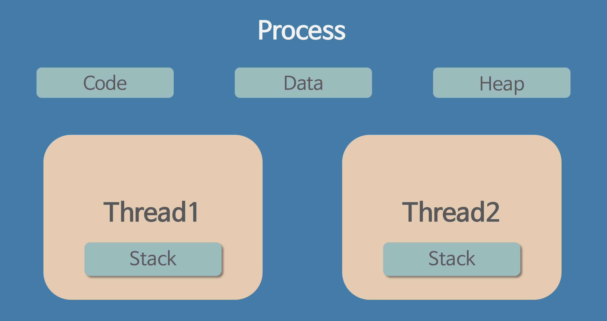

## 프로세스

> 프로세스는 메모리 위에 올라와 실행되고 있는 프로그램의 인스턴스이다.

### 프로세스의 특징
- 프로그램이 메모리에 올라와 프로세스가 되면 OS로부터 자원을 할당받는다.
    - PCB(프로세스 제어 블록)
        - 프로세스가 실행을 시작해서 끝날 때까지 PCB 안에 들어있는 내용들은 OS에 의해 관리된다.
        - PCB에는 프로세스 id, 프로세서 상태 정보(Processor State Information), 프로세스 제어 정보(Process Control Information)를 갖고 있다.
    - 스택 메모리
        - 지역변수 저장공간으로 각 함수가 실행되면 함수에 해당하는 메모리 공간이 스택 영역에 생긴다.
- 프로세스는 할당 받은 PCB, 스택과 힙 메모리, 프로그램 코드, 데이터 영역이 합쳐서 독립된 메모리 영역을 갖는다.
- 프로세스는 최소 1개의 쓰레드(메인 쓰레드)를 갖고 있다.
- 각 프로세스는 별도의 주소 공간에서 실행되며, 다른 프로세스의 변수나 자료구조에 접근할 수 없다.
- 프로세스는 프로세스 테이블에 등록되어 OS에 의해 관리된다.
    - 프로세스 테이블에는 프로세스 id, 프로세스 상태, 메모리 내의 위치 정보가 있다.
- 하나의 프로그램이 여러 개의 프로세스를 실행(fork)할 수 있으며 하나의 프로세스가 여러 개의 프로그램을 실행(exec)할 수 있다.

## 쓰레드

> 쓰레드는 프로세스 안에서 실행이 되는 단위이다.

### 쓰레드의 특징

- 쓰레드마다 각자의 TCB(쓰레드 제어 블록)을 갖고있다.
    - PCB에 들어있는 정보들 중 필요한 정보들을 나눠서 가진다.
    - TCB에는 쓰레드 id, 프로세서 상태 정보(Processor State Information)이 있다.
      → 각각의 쓰레드가 중단했을 때의 context가 다르므로
- 쓰레드는 프로세스 내에서 스택 영역만 따로 할당 받고 나머지 영역은 공유한다.
- 쓰레드는 프로세스 내의 자원을 공유한다.
- 쓰레드는 각자의 context를 갖고 있다.
    - 쓰레드마다 처리하는 작업이 다르고, 각 쓰레드가 중단했을 때의 cpu 레지스터 값이 다르기 대문이다.

### 쓰레드의 장점

- 프로세스를 만드는 것보다 쓰레드를 만드는데 더 적은 시간이 걸린다.
    - child 프로세스를 만들 경우 프로그램 전체를 복사하기 때문에 오래 걸리지만 쓰레드의 경우 프로그램 코드와 데이터를 공유하고 있기 때문에 스택 영역만 복사하면 된다.
- 프로세스보다 쓰레드를 종료할 때 더 적은 시간이 걸린다.
- context switching 시간이 더 적게 걸린다.
    - context switching : CPU가 현재 작업 중인 프로세스나 쓰레드의 상태를 저장하고 새 프로세스나 쓰레드의 저장된 상태를 메모리에 다시 적재하는 작업
- 프로세스의 경우 서로 통신하기 위해 OS의 도움을 받아야 하지만 쓰레드의 경우 공유된 메모리를 이용하여 OS의 도움 없이 서로 통신할 수 있다.

## 멀티 프로세스와 멀티 쓰레드

### 멀티 프로세스

- 멀티 프로세스는 여러 개의 프로세스를 동시에 진행하는 것이다.
    - ex) 음악 들으며 동시에 웹서핑
- 프로세서가 여러 개일 경우 동시에 여러 프로세스를 진행할 수 있지만, 프로세서가 하나인 경우 각 프로세스들이 time sharing을 하며 동시에 진행하는 것처럼 보이게 한다.(멀티 태스킹)
- 멀티 프로세스의 경우 여러 개의 자식 프로세스를 생성하여 동시에 진행하는데 부모-자식 관계라 해도 자신만의 독립적인 메모리 영역을 갖는다.

### 멀티 프로세스의 장점

- 안정성이 좋다.
    - 여러 개의 자식 프로세스 중 하나의 프로세스가 멈춰도 다른 프로세스에 영향을 미치지 않는다.
- 멀티 쓰레드처럼 동기화 작업을 하지 않아도 된다.
    - 각 프로세스는 독립적인 메모리 영역과 자원을 갖고 있다.

### 멀티 프로세스의 단점

- context switching시 멀티 쓰레드보다 overhead가 크다.
- 프로세스 사이의 통신이 어렵고 복잡하다.
    - 프로세스는 각각의 독립된 영역을 갖고 있기 때문에 프로세스 사이의 변수를 공유할 수 없다.
    - 안정성 문제로 다른 프로세스에 마음대로 접근할 수 없다.

### 멀티 쓰레드

- 멀티 쓰레드는 하나의 프로세스 안에서 여러 개의 쓰레드를 실행시키는 것이다.
    - ex) 메신저에서 내가 채팅을 입력하는 도중에 상대방으로부터 메시지를 받을 수 있다.
- 프로세스에는 하나 이상의 쓰레드를 갖고 있고, 멀티 쓰레드를 실행하기 위해서는 두 개 이상의 쓰레드가 필요하다.

### 멀티 쓰레드의 장점

- 응답성이 좋아진다.
    - 쓰레드가 blocked 상태가 되거나 긴 작업을 수행하더라도 다른 쓰레드들이 계속 작업을 처리하기 때문에 사용자에 대한 응답성이 증가한다.
- 시스템 처리량이 증가한다.
    - 쓰레드는 프로세스 자원(PCB, code, data, heap)을 공유하기 때문에 context switching이 빠르다.
    - 데이터를 주고 받는 것이 간단해지고 시스템 자원(시간)소모가 줄어들게 된다.

### 멀티 쓰레드의 단점

- 하나의 쓰레드에 문제가 발생하면 프로세스 전체에 영향을 받는다.
- 동기화 문제
    - critical section과 같이 같이 공유하는 자원에 동시에 접근하는 경우 문제가 발생할 수 있다.
    - 동기화 종류에는 mutex와 semaphore 등이 있다.
- 단일 프로세서 시스템에서는 효과를 기대하기 어렵다.
    - context switching, 동기화 문제, 쓰레드 생성 시간 등의 오버헤드가 발생하여 단일 쓰레드보다 느릴 수 있다.
