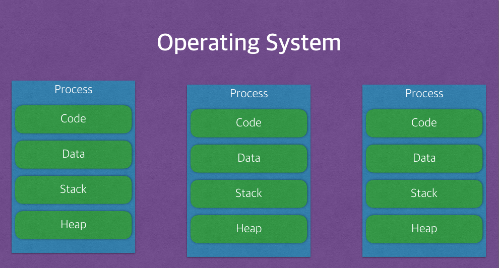
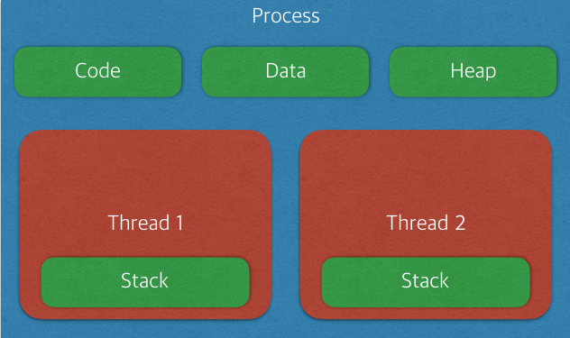

# 프로세스 VS 스레드

## 프로세스

- 메모리에 올라와 **실행되고 있는 프로그램의 인스턴스(독립적인 개체)**
- 기본적으로 프로세스마다 최소 1개의 스레드 소유 → 스레드가 실행되는 흐름의 단위이기 때문에
- 프로세스는 각각 별도의 주소공간 할당 (독립적)
  - Code : 코드 자체를 구성하는 메모리 영역(프로그램 명령)
  - Data : 전역변수, 정적변수, 배열 등
  - Heap : 동적 할당 시 사용 (new(), malloc() 등)
  - Stack : 지역변수, 매개변수, 리턴 값 (임시 메모리 영역)
- 한 프로세스는 다른 프로세스의 변수나 자료구조에 접근할 수 없다.
- 한 프로세스가 다른 프로세스의 자원에 접근하려면 프로세스 간의 통신(IPC, inter-process communication)을 사용해야 한다. (Ex. 파이프, 파일, 소켓 등을 이용한 통신 방법 이용)

## 스레드

- 프로세스 내에서의 여러 실행 흐름 단위
- 한 프로세스 내에서 Stack 영역만 따로 할당받고 나머지 (Code, Data, Heap) 영역은 서로 공유
- 독립적인 작업을 수행해야 하기 때문에 각자의 스택과 PC 레지스터 값을 갖고 있다.
  - 스택은 함수 호출 시 전달되는 인자, 되돌아갈 주소값 및 함수 내에서 선언하는 변수 등을 저장하기 위해 사용되는 메모리 공간이므로 스택 메모리 공간이 독립적이라는 것은 독립적인 함수 호출이 가능하다는 것이고 이는 독립적인 실행 흐름이 추가되는 것이다.
  - PC 값은 스레드가 명령어의 어디까지 수행하였는지를 나타나게 된다. 스레드는 CPU 를 할당받았다가 스케줄러에 의해 다시 선점당한다. 그렇기 때문에 명령어가 연속적으로 수행되지 못하고 어느 부분까지 수행했는지 기억할 필요가 있다. 따라서 PC 레지스터를 독립적으로 할당한다.

## 멀티 프로세스 VS 멀티 스레드

## 멀티 프로세스

- 프로그램을 여러개 실행 시키는 것으로 생각
- 장점
  - 안전성 (메모리 침범 문제를 OS 차원에서 해결)
- 단점
  - 각각 독립된 메모리영역을 가지고 있어 작업량이 많을 수록 오버헤드 발생.
- Context Switching으로 인한 성능 저하

## 멀티 쓰레드 ( > 멀티 프로세스)

- 하나의 프로그램 안에서 여러 스레드를 구성해 각 스레드마다 작업을 처리하는 것
- 장점
  - 독립적인 프로세스에 비해 공유 메모리만큼의 시간, 자원 손실이 감소
  - 프로세스 간 통신 방법에 비해 스레드 간의 통신 방법이 훨씬 간단 → 스레드 간의 통신이 필요한 경우 별도의 자원을 이용하는 것이 아니라 전역 변수의 공간 또는 동적으로 할당된 공간인 Heap 영역을 이용해 데이터를 주고받을 수 있다.
  - Context Switching시 스레드는 Stack 영역만 처리하기 때문에 프로세스 간 전환 속도보다 스레드 간의 전환 속도가 빠르다.
- 단점
  - 안정성 문제. 공유 하는 자원에 동시에 접근하는 일이 생길 수 있고 이를 해결해야 한다. → 동기화 작업 필요
  - 하나의 스레드가 데이터 공간을 망가뜨리면, 모든 스레드가 작동 불능 상태 → 공유 메모리를 갖기 때문

## Reference

- [https://github.com/gyoogle/tech-interview-for-developer/blob/master/Computer Science/Operating System/Process vs Thread.md](https://github.com/gyoogle/tech-interview-for-developer/blob/master/Computer%20Science/Operating%20System/Process%20vs%20Thread.md)
- [https://github.com/JaeYeopHan/Interview_Question_for_Beginner/tree/master/OS#프로세스와-스레드의-차이](https://github.com/JaeYeopHan/Interview_Question_for_Beginner/tree/master/OS#%ED%94%84%EB%A1%9C%EC%84%B8%EC%8A%A4%EC%99%80-%EC%8A%A4%EB%A0%88%EB%93%9C%EC%9D%98-%EC%B0%A8%EC%9D%B4)
- [https://github.com/WeareSoft/tech-interview/blob/master/contents/os.md#프로세스와-스레드의-차이](https://github.com/WeareSoft/tech-interview/blob/master/contents/os.md#%ED%94%84%EB%A1%9C%EC%84%B8%EC%8A%A4%EC%99%80-%EC%8A%A4%EB%A0%88%EB%93%9C%EC%9D%98-%EC%B0%A8%EC%9D%B4)