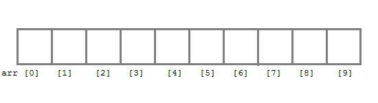
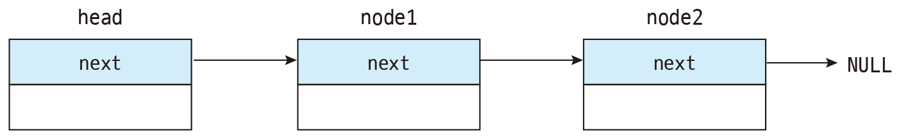
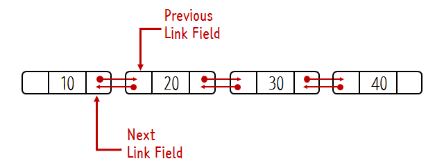
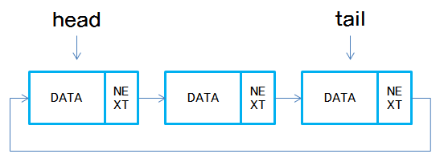

# Array & LinkedList

- Array

  

  - 동일한 크기의 메모리 공간이 연속적으로 나열된 자료 구조 또한 정해진 메모리크기를 미리 할당
  - 인덱스를 통해 단 한번의 연산으로 임의의 요소에 바로 접근이 가능 O(1)
  - 정렬되지 않는 배열에서 특정값을 탐색할때 처음부터 탐색을 시작해야 하는 O(n)시간이 걸림
  - 배열에 원소를 삽입, 삭제를 할때 요소를 이동해야 하는 단점이 있음

- Linked List

  - 노드의 포인터를 이용해서 서로 연결시킨 구조
  - 데이터가 메모리상에서 연속적으로 저장된 것이 아니라 데이터를 가지고 있는 노드가 메모리 공간에서 서로를 참조하고 있기 때문에 resize 과정이 불필요함
  - 데이터의 삽입,삭제가 용이하다
  - 데이터 검색은 비효율적
    - index를 가지고 있지 않기 때문에 처음부터 살펴 봐야 하는 단점이 있음
  - 연결리스트 종류

    - 단일연결리스트
      
      - next만 존재, 공간복잡도가 적지만 오직 직진만 가능
    - 이중연결리스트
      
      - next, prev가 존재
      - 노드의 이전, 이후로의 이동에 용이, 공간복잡도가 커짐
    - 원형연결리스트
      

      - 마지막 tail이 head를 바로 가리킴
      - 순회시에 용이

      ⭐️ 자바스크립트에서 배열이란?

      - 배열 각각의 메모리 공간은 동일한 크기를 가지고 있지 않아도 되고 연속적으로 이어져 있지 않을 수 도 있음 → 희소 배열(sparse array)
      - 일반적 의미의 배열이 아닌 특수객체(index를 key로 가지는)
        ```jsx
        const arr = [
          "string",
          10,
          true,
          null,
          undefined,
          NaN,
          Infinity,
          [],
          {},
          function () {},
        ];
        ```
      - 해시테이블의 형태를 가지고 있음, 삽입, 삭제에 경우에 일반적인 배열보다 빠르다.
