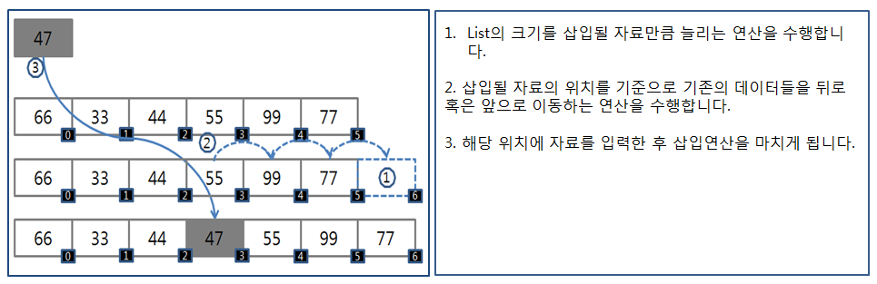

# Array & ArrayList & LinkedList

## `Array`

- 메모리 공간에 일정 사이즈를 할당받아 사용하는 자료구조
- 논리적 저장 순서와 물리적 저장 순서가 일치한다.
- index를 통해 O(1) 시간복잡도로 데이터 참조 가능.
- 크기가 고정적
  - 데이터가 계속 늘어나는 경우 최대 사이즈를 알 수 없을 떄 사용하기 부적합
  - 해당 크기보다 적게 사용하는 경우 빈 공간들이 낭비된다.
- 삭제를 할 때 특정 원소에 접근하여 O(1)에 삭제할 수 있지만, 그 공간이 빈 공간이 되어 배열의 연속성이 깨지게 된다. 그래서 빈 공간을 채우기 위해 삭제된 index 보다 더 큰 index를 갖은 원소들을 shift 해주어야 하는 비용(O(n))이 발생된다.
- 삽입의 경우에도 특정 원소에 접근하여 O(1)시간에 삽입이 가능하지만 삽입을 위해 해당 공간을 마련하려면 원소들을 뒤로 shift 해야하는 비용(O(n))이 발생된다.

## `List`

- `Array`의 고정적인 사이즈를 갖는 반면에 유동적인 사이즈를 갖을 수 있는 자료구조

### `ArrayList`

- `Array`를 기반으로 하는 하기 때문에 그 특성을 모두 갖는다.
- 크기가 가득 차게 되면 `Array` 의 크기를 일정 비율(1.5, 2 등)으로 증가시킨다.

### `LinkedList`

- 노드에 값이 저장되고 포인터를 통해 다음 노드가 연결되어 있는 구조
- 데이터의 중간에 삽입 및 삭제를 하더라도 shift가 필요하지 않고 링크만 변경해주면 되기 때문에 O(1) 시간에 가능하다.
- 특정 데이터를 참조하려면 index가 없기 때문에 포인터를 통해 처음부터 노드를 하나씩 찾아가야 하기 때문에 O(n) 시간이 걸린다.
  - `Array`와 다르게 논리적 저장 순서와 물리적 저장 순서가 일치하지 않기 때문

## Reference

- [https://github.com/gyoogle/tech-interview-for-developer/blob/master/Computer%20Science/Data%20Structure/Array%20vs%20ArrayList%20vs%20LinkedList.md](https://github.com/gyoogle/tech-interview-for-developer/blob/master/Computer%20Science/Data%20Structure/Array%20vs%20ArrayList%20vs%20LinkedList.md)
- [https://github.com/JaeYeopHan/Interview_Question_for_Beginner/tree/master/DataStructure#array-vs-linked-list](https://github.com/JaeYeopHan/Interview_Question_for_Beginner/tree/master/DataStructure#array-vs-linked-list)
- [https://velog.io/@adam2/Array%EC%99%80-List%EA%B7%B8%EB%A6%AC%EA%B3%A0-Java-List](https://velog.io/@adam2/Array%EC%99%80-List%EA%B7%B8%EB%A6%AC%EA%B3%A0-Java-List)
